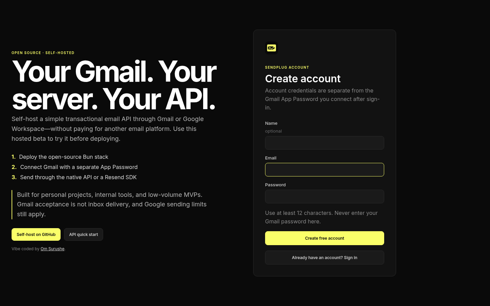

<p align="center"></p>
<h1 align="center">SendPlug</h1>
<p align="center"><strong>Your Gmail. Your server. Your email API.</strong></p>
<p align="center">
  <a href="https://github.com/om-surushe/SendPlug/actions/workflows/ci.yml"></a>
  <a href="LICENSE"></a>
  <a href="https://sendplug.nirmaker.com"></a>
  
</p>
<p align="center">Vibe coded by <a href="https://omsurushe.bio.link">Om Surushe</a>.</p>

Self-host a simple transactional email API through Gmail or Google Workspace without paying for another email platform. The [hosted beta](https://sendplug.nirmaker.com) is a try-before-you-deploy instance of the same open-source Bun/Elysia, React, PostgreSQL, and Redis/BullMQ stack. The preserved Python/SQLite release remains the production rollback path.

> **Project status:** Complete. The current feature set is final; no future feature roadmap is planned.

<p align="center"><a href="https://sendplug.nirmaker.com"></a></p>

## Why SendPlug?

- Use an existing Gmail or Google Workspace sender for low-volume application email.
- Keep sender credentials encrypted on infrastructure you control.
- Issue sender-scoped API tokens and use either the native API or the tested Resend SDK subset.
- Run the complete stack on one VM with Docker Compose.

> Account authentication and Gmail sender access are separate. Email/password signup works without OAuth. Delivery uses a separately supplied Gmail App Password over SMTP; SendPlug does not request Gmail OAuth/API scopes.

## Self-host on one VM

Requirements: Docker with Compose, a persistent disk, and an HTTPS reverse proxy.

```bash
cp revamp.env.example revamp.env
mkdir -m 700 secrets
python3 - <<'PY' > secrets/credential_key
import base64, secrets
print(base64.urlsafe_b64encode(secrets.token_bytes(32)).decode())
PY
openssl rand -hex 32 > secrets/token_pepper
python3 - <<'PY'
from pathlib import Path
import secrets, subprocess
p = Path("revamp.env")
s = p.read_text()
s = s.replace("SENDPLUG_IMAGE_TAG=\n", f"SENDPLUG_IMAGE_TAG={subprocess.check_output(['git', 'rev-parse', '--short=12', 'HEAD'], text=True).strip()}\n")
s = s.replace("POSTGRES_PASSWORD=\n", f"POSTGRES_PASSWORD={secrets.token_urlsafe(32)}\n")
s = s.replace("RECOVERY_ADMIN_PASSWORD=\n", f"RECOVERY_ADMIN_PASSWORD={secrets.token_urlsafe(32)}\n")
s = s.replace("SESSION_SECRET=\n", f"SESSION_SECRET={secrets.token_urlsafe(48)}\n")
p.write_text(s)
PY
chmod 600 revamp.env secrets/*
printf '\nSENDPLUG_RUNTIME_UID=%s\nSENDPLUG_RUNTIME_GID=%s\n' "$(id -u)" "$(id -g)" >> revamp.env
# Edit PUBLIC_ORIGIN, RECOVERY_ADMIN_EMAIL, and DATABASE_URL. The URL password
# must match POSTGRES_PASSWORD and be URL-encoded if it contains reserved bytes.
docker compose --env-file revamp.env -f compose.revamp.prod.yml config -q
docker compose --env-file revamp.env -f compose.revamp.prod.yml up -d --build
curl -fsS http://127.0.0.1:8100/health
```

The one-shot `migrate` service runs `prisma migrate deploy` before API and worker startup. The API image builds and serves the React application from the same origin. PostgreSQL and Redis use named volumes; Redis is persistent and uses `noeviction`. Only the API is published, on loopback. Terminate TLS in Caddy, Nginx, or another maintained proxy and overwrite (do not append or trust) `X-Real-IP`.

Never use `docker compose down -v` during updates, rollback, or recovery. Volumes are not backups. Use the [cutover runbook](docs/operations/cutover.md) when migrating an existing SQLite deployment.

## Authentication and senders

Local email/password registration is the default and is independent of WorkOS. Set `AUTH_SIGNUPS_ENABLED=false` to close registration while retaining existing and recovery-admin login. To enable WorkOS, set all four `WORKOS_*` values and register `${PUBLIC_ORIGIN}/workos/callback`; partial configuration is rejected.

Create a Google App Password after enabling Google 2-Step Verification, add it in **Senders**, and run the connection test. Workspace policy or Advanced Protection may prevent App Password creation. Normal Google passwords are not supported.

## API tokens and manual overlap rotation

Tokens are bound to one sender and `send` and/or `status` scopes. Raw values are displayed once.

1. Create a second token for the same sender and scopes.
2. Deploy it to the client while the old token still works.
3. Verify a successful request and the new token's `last_used_at`.
4. Revoke the old token.

Editing token metadata does not issue new key material.

### Native API

Hosted beta base URL: `https://sendplug.nirmaker.com`

```bash
export SENDPLUG_BASE_URL=https://sendplug.nirmaker.com
curl -X POST "$SENDPLUG_BASE_URL/api/v1/send" \
  -H "Authorization: Bearer $SENDPLUG_API_TOKEN" \
  -H 'Content-Type: application/json' \
  -d '{"to":["customer@example.com"],"subject":"Welcome","body":"Hello","html":"<p>Hello</p>"}'

curl "$SENDPLUG_BASE_URL/api/v1/emails/$MESSAGE_ID" \
  -H "Authorization: Bearer $SENDPLUG_API_TOKEN"
```

### Resend-compatible subset

`POST /emails` accepts `from`, `to`, `cc`, `bcc`, `subject`, `text`, and `html`. `from` must equal the token-bound sender and cannot select credentials. At least one of `text` or `html` is required. This is not full Resend compatibility: attachments, templates, tags, schedules, batches, custom headers, reply-to, webhooks, domains, and idempotency keys are unavailable.

```js
import { Resend } from "resend";
const resend = new Resend(process.env.SENDPLUG_API_TOKEN, {
  baseUrl: process.env.SENDPLUG_BASE_URL,
});
const { data, error } = await resend.emails.send({
  from: "sender@gmail.com", to: ["customer@example.com"],
  subject: "Welcome", text: "Your account is ready.",
});
if (error) throw error;
console.log(data.id);
```

Client requests have no idempotency protection. Do not automatically retry ambiguous timeouts or 5xx responses unless duplicate mail is acceptable. `sent` records Gmail SMTP acceptance, not inbox delivery.

## Development and validation

```bash
bun install --frozen-lockfile
bun run db:generate
bun run db:validate
bun run test
bun run typecheck
bun run build
npm ci --prefix web && npm run build --prefix web

# Python/SQLite rollback implementation
python3 -m venv .venv && . .venv/bin/activate
pip install -r requirements.txt
pytest -q
```

Architecture and operational details are in [`docs/architecture/bun-revamp.md`](docs/architecture/bun-revamp.md), [`docs/operations/migration.md`](docs/operations/migration.md), and [`docs/operations/cutover.md`](docs/operations/cutover.md).

## Security and license

Review the operator trust boundaries and incident guidance in [SECURITY.md](SECURITY.md). SendPlug is licensed under the [MIT License](LICENSE) © Om Surushe.
